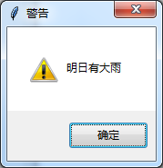
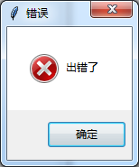

```python
import tkinter.messagebox #弹窗库```
import tkinter
```

1、提示消息框

tkinter.messagebox.showinfo('提示','人生苦短')


2、消息警告框

tkinter.messagebox.showwarning('警告','明日有大雨')



3、错误消息框

tkinter.messagebox.showerror('错误','出错了')



4、对话框

```python
tkinter.messagebox.askokcancel('提示', '要执行此操作吗')#确定/取消，返回值true/false

tkinter.messagebox.askquestion('提示', '要执行此操作吗')#是/否，返回值yes/no

tkinter.messagebox.askyesno('提示', '要执行此操作吗')#是/否，返回值true/false

tkinter.messagebox.askretrycancel('提示', '要执行此操作吗')#重试/取消，返回值true/false
```


5、文件对话框

```python
import tkinter.filedialog
a=tkinter.filedialog.asksaveasfilename()#返回文件名
print(a)
a =tkinter.filedialog.asksaveasfile()#会创建文件
print(a)
a =tkinter.filedialog.askopenfilename()#返回文件名
print(a)
a =tkinter.filedialog.askopenfile()#返回文件流对象
print(a)
a =tkinter.filedialog.askdirectory()#返回目录名
print(a)
a =tkinter.filedialog.askopenfilenames()#可以返回多个文件名
print(a)
a =tkinter.filedialog.askopenfiles()#多个文件流对象
print(a)
```


\---------------------
作者：DeardeerU
来源：CSDN
原文：https://blog.csdn.net/Bugest/article/details/81557112
版权声明：本文为博主原创文章，转载请附上博文链接！