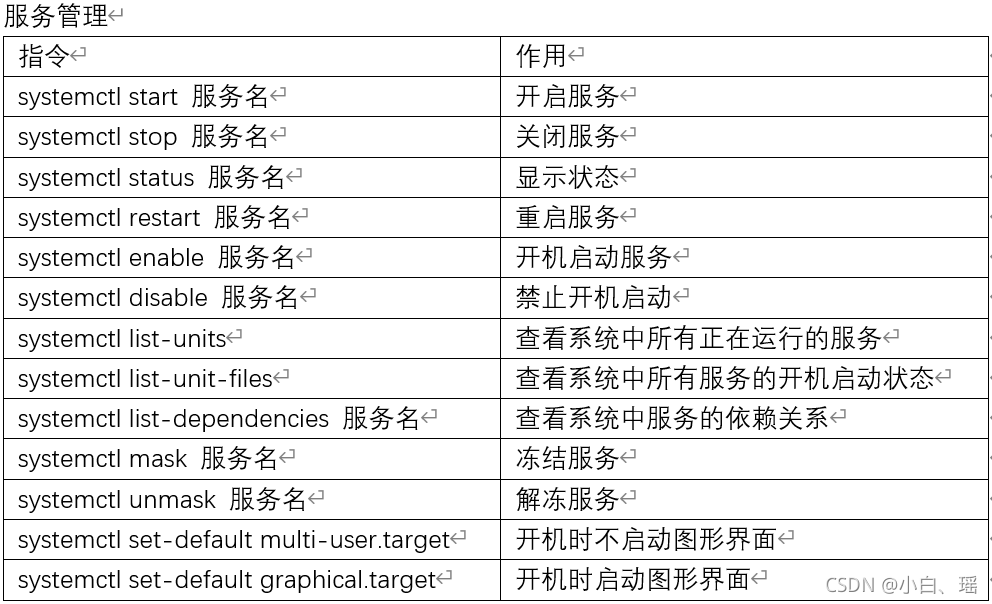

# Jetson nano USB声卡调试
1. 检查是否有USB声卡设备
``` lsusb ```
2. 查看声卡设备信息
``` aplay -l ```
3. 查看usb声卡控制参数
``` amixer -c cardid ```
4. 调节音量大小
``` amixer -c cardid set cardname xx%|xx ```
5. 播放音频文件
``` aplay xxx.wav ```
6. pactl命令


# 修改音频文件属性

使用 sox 查看音频属性：```sox -V xx.wav -n```

修改属性：复制一份wav文件保存audio_ok_name, 利用sox调整参数--通道-1 位-16 采样率-16k

```subprocess.call(["sox {} -r 16000 -b 16 -c 1 {}".format(audio_name, audio_ok_name)], shell=True)```

`sox audioname -r 48000 -b 16 -c 1 outfilename`


# 查看启动服务

```bash
sudo lsof | grep /dev/tty*           # 列出串口占用程序
sudo systemctl list-unit-files | grep enabled   #列出允许开机自启 
sudo systemctl disable nginx.service # 禁止开机启动
sudo systemctl stop nginx.service    # 停止服务
```




# APT错误

```bash
sudo apt-get clean
sudo apt-get update && sudo apt-get upgrade

sudo dpkg --configure -a
sudo apt-get -f install
```

