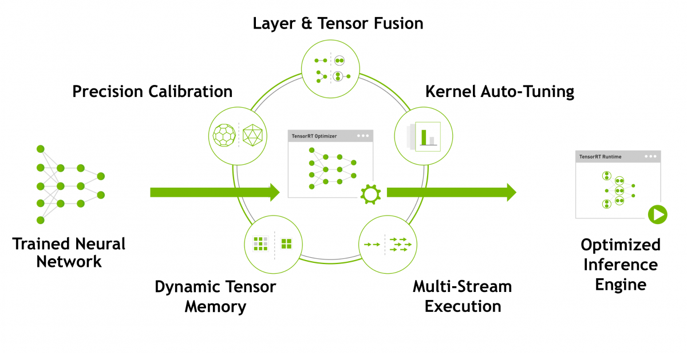
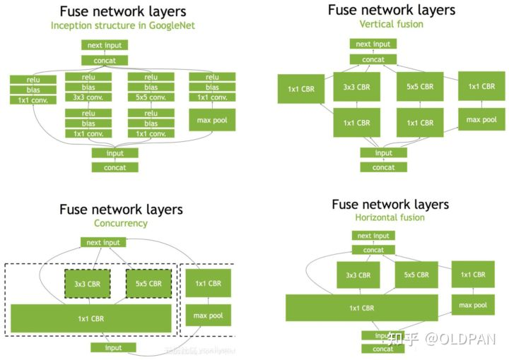
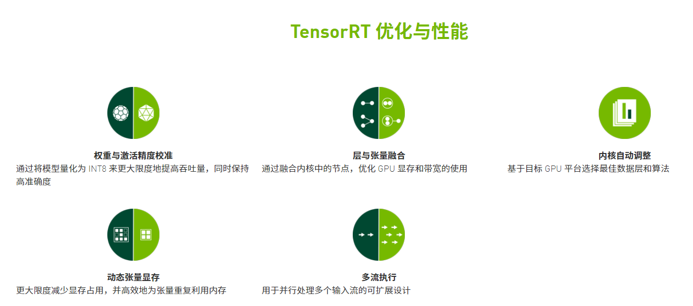

# TensorRT简介

NVIDIA TensorRT™ 是用于高性能深度学习推理的 SDK。此 SDK 包含深度学习推理优化器和运行时环境，可为深度学习推理应用提供低延迟和高吞吐量。**TensorRT™的核心是一个C ++库，可以促进在NVIDIA图形处理单元（GPU）上的高性能推断**。它旨在与TensorFlow，Caffe，PyTorch，MXNet等深度学习训练框架以互补的方式工作。它专注于在GPU上快速有效地运行已经训练过的网络，以便生成结果（在各个地方称为评分、检测、回归或推理的过程）。

**TensorRT 以 NVIDIA 的并行编程模型 CUDA 为基础构建而成**，可帮助您利用 CUDA-X 中的库、开发工具和技术，针对人工智能、自主机器、高性能计算和图形优化所有深度学习框架中的推理。

TensorRT 针对多种深度学习推理应用的生产部署提供 INT8 和 FP16 优化，例如视频流式传输、语音识别、推荐和自然语言处理。推理精度降低后可显著减少应用延迟，这恰巧满足了许多实时服务、自动和嵌入式应用的要求。

TensorRT通过组合层和优化内核选择来优化网络，从而改善延迟、吞吐量、功效和内存消耗。如果应用程序指定，它还将优化网络以更低的精度运行，进一步提高性能并降低内存需求。

一般来说，深度学习的开发分为三部分1. 训练，2. 推理 3. 部署 。TensorRT不参与训练阶段

## TensorRT加速过程

### Precision Calibration

**精确校准，即量化**。模型量化的一个核心思想是高精度模型在训练是重要的，然而在推理阶段我们不需要用非常复杂的精度来表示。最为naive的想法就是我们可以用更少的比特来表示原先的模型权重，损失掉的如果只是一些噪声，那理论上我们应该仍能很好地保持模型的精度。

官网上有提到trt支持INT8 和 FP16两种更简化的精度格式，神经网络模型再进行训练的时候都需要将数据转成张量 ( Tensor )，而 Tensor 的数据型态通常为FP32 ( 单精度浮点数 )，使用trt优化的FP16或INT8可降低模型大小，从而加速计算。

### Layer & Tensor Fusion

**层与张量融合，算子融合。**

简单来说就是通过融合一些计算op或者去掉一些多余op来减少数据流通次数以及显存的频繁使用来提速

在垂直层面，通过将conv、BN、relu层融合成一个层，所谓的CBR；在水平层面，将输入为相同张量和执行操作相同的层融合。将concat层去除，即不需要再将输入合并，直接将输入送到下一个输入中，相当于减少了一次传输吞吐。通过层与张量的融合，合并相同结构，减少网络层数，能够更高效利用GPU的并行计算资源。

通过上述的算子融合、动态显存分配、精度校准、多steam流、自动调优等操作，得到一个优化后的推理模型。

## Tensort模型转换

1. 手动构建模型转换

    [TensorRTx](https://link.zhihu.com/?target=https%3A//github.com/wang-xinyu/tensorrtx)

2. 使用ONNX2TensorRT，Onnx转换trt

3. 使用TF-TRT，将TensorRT集成再TensoFlow中

根据模型的不同，转换难度有差异，如果行不通，可尝试用其他办法转换。

=======
# TensorRT简介

NVIDIA TensorRT™ 是用于高性能深度学习推理的 SDK。此 SDK 包含深度学习推理优化器和运行时环境，可为深度学习推理应用提供低延迟和高吞吐量。**TensorRT™的核心是一个C ++库，可以促进在NVIDIA图形处理单元（GPU）上的高性能推断**。它旨在与TensorFlow，Caffe，PyTorch，MXNet等深度学习训练框架以互补的方式工作。它专注于在GPU上快速有效地运行已经训练过的网络，以便生成结果（在各个地方称为评分、检测、回归或推理的过程）。

**TensorRT 以 NVIDIA 的并行编程模型 CUDA 为基础构建而成**，可帮助您利用 CUDA-X 中的库、开发工具和技术，针对人工智能、自主机器、高性能计算和图形优化所有深度学习框架中的推理。

TensorRT 针对多种深度学习推理应用的生产部署提供 INT8 和 FP16 优化，例如视频流式传输、语音识别、推荐和自然语言处理。推理精度降低后可显著减少应用延迟，这恰巧满足了许多实时服务、自动和嵌入式应用的要求。

TensorRT通过组合层和优化内核选择来优化网络，从而改善延迟、吞吐量、功效和内存消耗。如果应用程序指定，它还将优化网络以更低的精度运行，进一步提高性能并降低内存需求。

一般来说，深度学习的开发分为三部分1. 训练，2. 推理 3. 部署 。TensorRT不参与训练阶段

## TensorRT加速过程

### Precision Calibration

**精确校准，即量化**。模型量化的一个核心思想是高精度模型在训练是重要的，然而在推理阶段我们不需要用非常复杂的精度来表示。最为naive的想法就是我们可以用更少的比特来表示原先的模型权重，损失掉的如果只是一些噪声，那理论上我们应该仍能很好地保持模型的精度。

官网上有提到trt支持INT8 和 FP16两种更简化的精度格式，神经网络模型再进行训练的时候都需要将数据转成张量 ( Tensor )，而 Tensor 的数据型态通常为FP32 ( 单精度浮点数 )，使用trt优化的FP16或INT8可降低模型大小，从而加速计算。

### Layer & Tensor Fusion

**层与张量融合，算子融合。**

简单来说就是通过融合一些计算op或者去掉一些多余op来减少数据流通次数以及显存的频繁使用来提速

在垂直层面，通过将conv、BN、relu层融合成一个层，所谓的CBR；在水平层面，将输入为相同张量和执行操作相同的层融合。将concat层去除，即不需要再将输入合并，直接将输入送到下一个输入中，相当于减少了一次传输吞吐。通过层与张量的融合，合并相同结构，减少网络层数，能够更高效利用GPU的并行计算资源。

通过上述的算子融合、动态显存分配、精度校准、多steam流、自动调优等操作，得到一个优化后的推理模型。

## Tensort模型转换

1. 手动构建模型转换

    [TensorRTx](https://link.zhihu.com/?target=https%3A//github.com/wang-xinyu/tensorrtx)

2. 使用ONNX2TensorRT，Onnx转换trt

3. 使用TF-TRT，将TensorRT集成再TensoFlow中

根据模型的不同，转换难度有差异，如果行不通，可尝试用其他办法转换。

